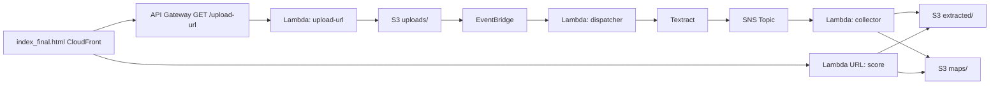

## AI Resume Matcher (Serverless on AWS)

## Overview

AI Resume Matcher is an **end-to-end serverless pipeline** that automatically extracts text from resumes (PDFs) and matches it against a given job description.
What makes this project special is that it’s built entirely with **Infrastructure as Code (IaC)** using **AWS CloudFormation**.  
All AWS resources — S3 buckets, Lambda functions, IAM roles, API Gateway routes, EventBridge rules, and SNS topics — are provisioned and managed through YAML stacks. This ensures the system is reproducible, maintainable, and production-ready.

---

## 🚀 Demo
- **UI (CloudFront):** https://d2a16brw1up50y.cloudfront.net

---

## Architecture

## How it works

1. Frontend (CloudFront + S3): User uploads a resume PDF via the UI.
2. Presigned URL Lambda + API Gateway: Generates a temporary upload link.
3. S3 + EventBridge: New file in uploads/ triggers the dispatcher Lambda.
4. Textract + SNS + Collector Lambda: Extracts text, stores results in extracted/ and maps/.
5. Score Lambda: Compares resume text with job description and returns similarity score + missing keywords.
6. UI: Displays the result back to the user.

## Services Used

- **Amazon S3** – stores resumes, extracted text, and JSON maps
- **Amazon CloudFront** – serves static UI globally
- **Amazon API Gateway** (HTTP API) – routes requests to Lambda
- **AWS Lambda** (Node.js 20) – serverless functions: upload-url, dispatcher, collector, score
- **Amazon Textract** – extracts structured text from resumes
- **Amazon SNS** – event channel for Textract results
- **Amazon EventBridge** – triggers dispatcher Lambda on file uploads
- **AWS IAM Roles & Policies** – secure access control

## How to Use

1. Open the CloudFront UI: https://d2a16brw1up50y.cloudfront.net
2. Upload a resume PDF (max ~10 MB).
3. Paste a job description into the text box.
4. Submit → wait a few seconds while Textract processes the resume.
5. View your similarity score and missing keywords in the results.

## License
This project is licensed under the MIT License – see the LICENSE file for details.
