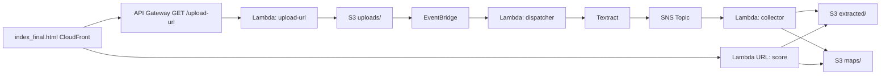

# 📝 AI Resume Matcher (Serverless on AWS)

End-to-end serverless pipeline to match resume PDFs against job descriptions.  
This project demonstrates how to build a **scalable, cost-effective, and fully serverless application** on AWS using S3, Lambda, Textract, API Gateway, and CloudFront.  
The system allows users to upload resumes, extract text with Textract, and compute a similarity score against a job description — all without managing servers.

---

## 🚀 Demo
- **UI (CloudFront):** https://d2a16brw1up50y.cloudfront.net

---

## 🏗 Architecture

## How it works

1. Frontend (CloudFront + S3): User uploads a resume PDF via the UI.
2. Presigned URL Lambda + API Gateway: Generates a temporary upload link.
3. S3 + EventBridge: New file in uploads/ triggers the dispatcher Lambda.
4. Textract + SNS + Collector Lambda: Extracts text, stores results in extracted/ and maps/.
5. Score Lambda: Compares resume text with job description and returns similarity score + missing keywords.
6. UI: Displays the result back to the user.
